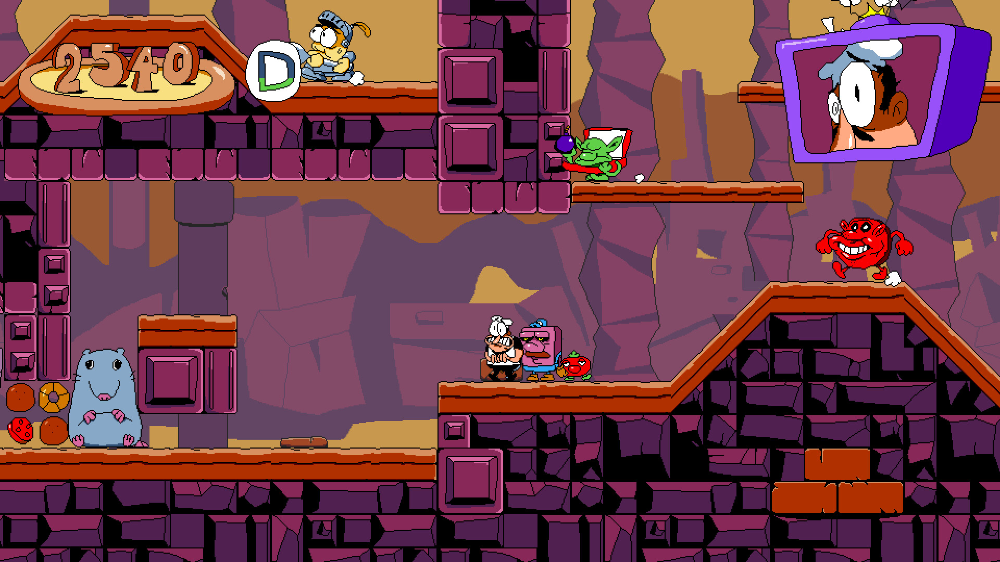
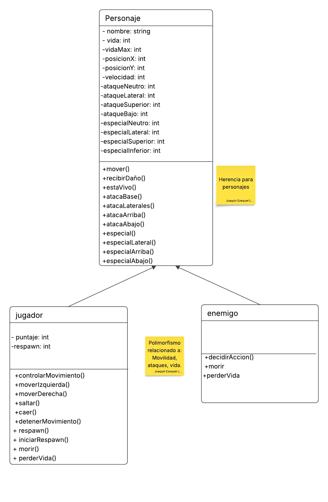
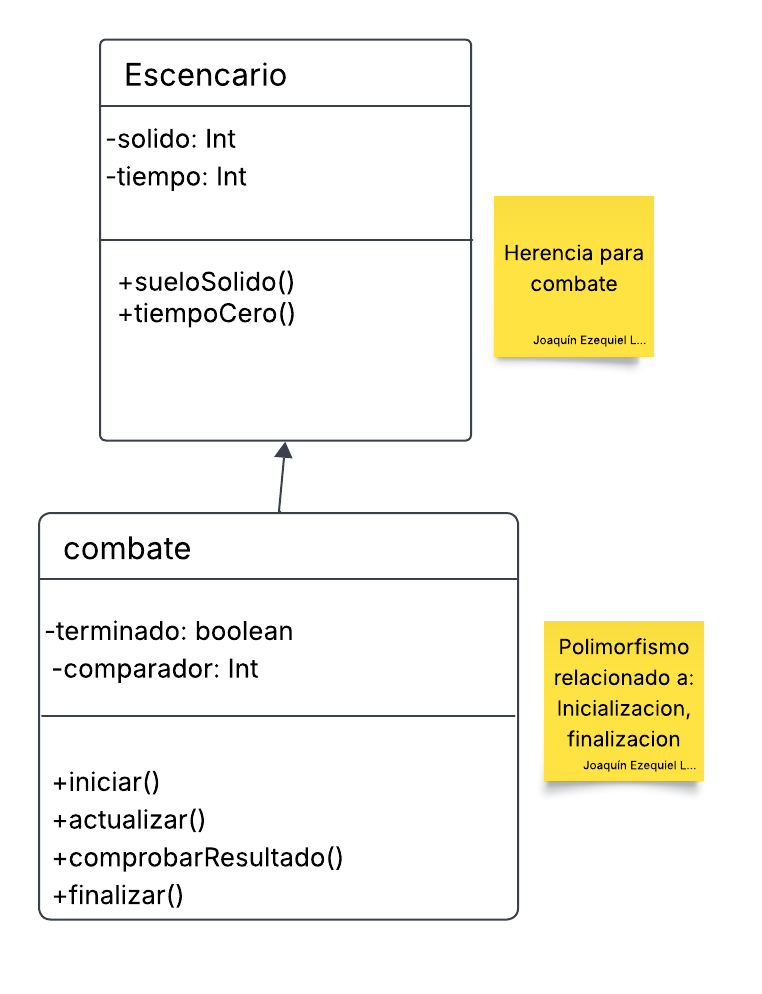

# trabajo-final-POO-2026

# Proyecto: the ultimate last punch 

## 1. Integrantes del Equipo 

- Luna  Joaquin 
- Ojeda Joaquin  
- Gonzalez Leylen
- Peralta Gustavo

## 2. Dominio y Alcance del Sistema 

### Descripción del Problema
Se busca desarrollar una aplicación de escritorio correspondiente al género plataform fighting, basada en un torneo o "Torre de Poder", en el que el jugador deberá seleccionar un personaje y avanzar a través de una serie de combates hasta llegar al enfrentamiento final.
El juego contará inicialmente con 3 personajes jugables, cada uno con características y habilidades diferentes. El jugador deberá superar distintos oponentes y minijefes a medida que avance en el torneo, hasta enfrentarse al jefe final.

### Objetivo del Sistema
El sistema será un juego funcional y extensible que permitirá al jugador experimentar las mecánicas básicas de un juego de peleas 2D.
El diseño buscará mantener una estructura organizada y modular que permita agregar posteriormente nuevos personajes, oponentes, habilidades, eventos o combates, aplicando los conceptos del paradigma orientado a objetos vistos durante la materia.

### Funcionalidades Principales (Features)
**Selección de Personaje:
    El jugador podrá seleccionar uno de los personajes disponibles.
    Cada personaje contará con características y habilidades diferentes.
**Sistema de Combates:
    El jugador se enfrentará a diferentes oponentes controlados por el sistema.
    Los personajes contarán con ataques básicos y habilidades especiales.
    Los combates tendrán una dificultad progresiva.
    El jugador podrá ganar o perder cada combate según el resultado de la pelea.
**Sistema de Progresión:
    El jugador avanzará a través de una serie de combates.
    La progresión inicial será:
    Combate → Minijefe → Combate → Minijefe → Jefe Final
    Los minijefes podrán presentar desafíos o condiciones diferentes.
**El objetivo final será derrotar al jefe y completar el torneo.
    Personajes y Oponentes:
    Existirán diferentes personajes y oponentes.
    Cada uno podrá contar con características, ataques y habilidades propias.
    Los oponentes serán controlados por el sistema mediante comportamientos simples adecuados al alcance del proyecto.
**Interfaz Gráfica (IGU):
    Pantalla de inicio y selección de personaje.
    Visualización del combate, personajes y estado de los jugadores.
    Visualización de puntos de vida y demás información relevante.
    Pantallas para mostrar la victoria, derrota y progreso del jugador.
**Persistencia:
    El sistema permitirá guardar los resultados o puntajes obtenidos por los jugadores.
    Los mejores resultados podrán ser consultados posteriormente mediante un sistema de High Scores almacenado en una base de datos.

## 3. Arquitectura y diseño

### Patron de diseño adicional: 

### Diagramas de diseños:

## 4. Stack Tecnológico 

- **Lenguaje:** Java 17
- **IDE:** Visual Studio Code
- **Base de Datos:** MySQL 8.0 (para persistencia de High Scores)
- **Framework de IGU:** Java Swing
- **Control de Versiones:** Git y GitHub Classroom
