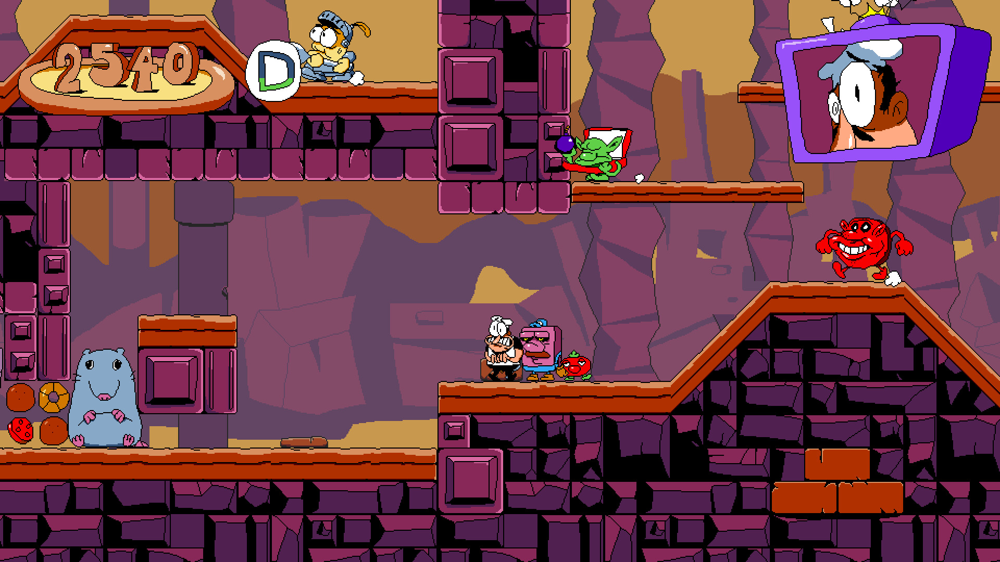
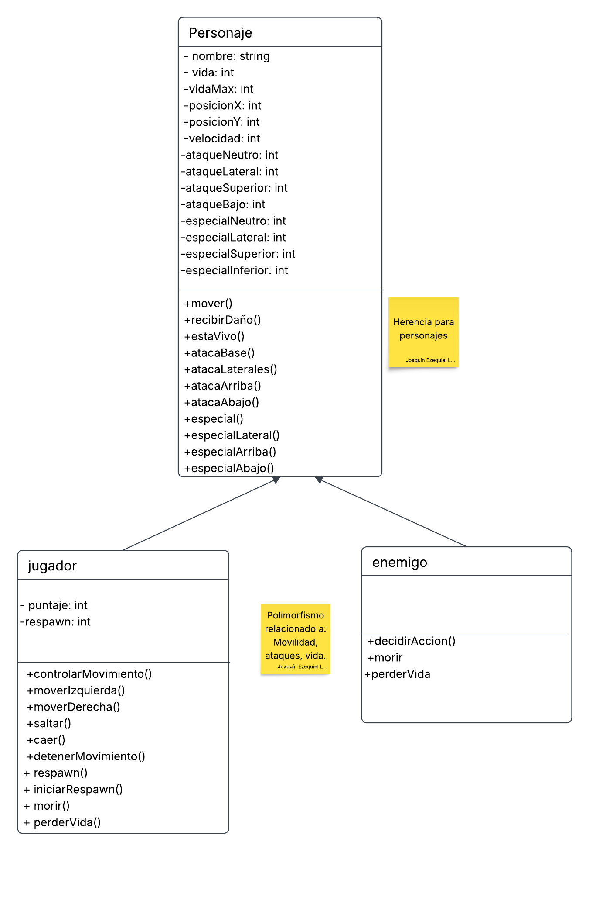
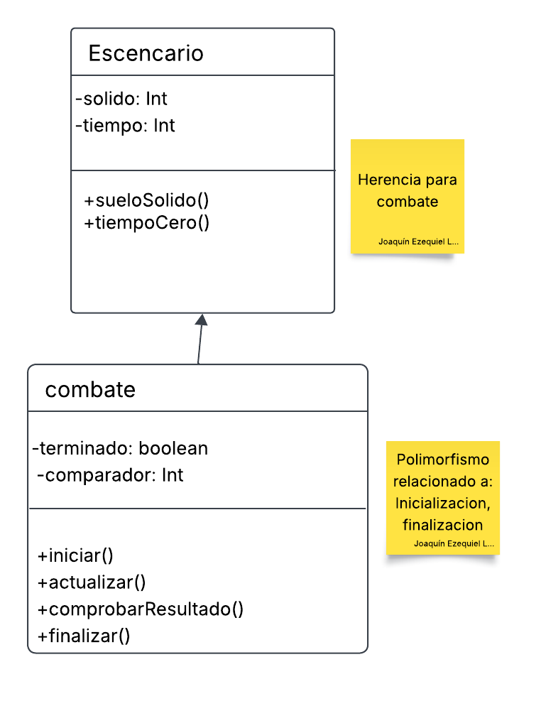

# trabajo-final-POO-2026

# Proyecto: the ultimate last punch 

## 1. Integrantes del Equipo 

- Luna  Joaquin 
- Ojeda Joaquin  
- Luz Clara Gustavo
- Liñeiro Federico

## 2. Dominio y Alcance del Sistema 

### Descripción del Problema
Se busca desarrollar una aplicación de escritorio correspondiente al género plataform fighting, cosistiendo en batallas cortas entre jugadores. Cada jugador podra elegir entre 2 personajes para jugar.
El juego contará inicialmente con 2 personajes jugables, cada uno con características y habilidades diferentes.

### Objetivo del Sistema
El sistema será un juego funcional y extensible que permitirá al jugador experimentar las mecánicas básicas de un juego de peleas 2D.
El diseño buscará mantener una estructura organizada y modular que permita agregar posteriormente nuevos personajes, habilidades, eventos o combates, aplicando los conceptos del paradigma orientado a objetos vistos durante la materia.

### Funcionalidades Principales (Features)
**Selección de Personaje:
    Los jugadores podrán seleccionar uno de los personajes disponibles.
    Cada personaje contará con características y habilidades diferentes.
**Sistema de Combates:
    Los jugadores controlaran a sus personajes para pelear entre si.
    Los personajes contarán con ataques básicos y habilidades especiales.
    Los combates seran cortos y tendran una cuenta regresiva.
    El primer jugador en reducir la vida de su openente a 0 sera el victorioso. O En caso de que se termine el timpo cronometrado, el jugador con mayor cantidad de vida.
    Durante el combate, ambos jugadores podran generar puntaje por condiciones diferente.
**El objetivo final sera llegar al mayor puntaje posible en los combates para medirse entre los jugadores.
    Puntaje en combate:
    Al dañar al oponente y segun la vida restante al finalizar el combate, los jugadores ganaran puntos.
    El puntaje de cada combate se guardara una base de datos junto a 3 letras como identificativo.
    Cada combate tiene un puntaje individual.
**Interfaz Gráfica (IGU):
    Pantalla de inicio y selección de personaje.
    Visualización del combate, personajes y estado de los jugadores.
    Visualización de puntos de vida y demás información relevante.
    Pantallas para mostrar la victoria, derrota y progreso del jugador.
**Persistencia:
    El sistema permitirá guardar los resultados o puntajes obtenidos por los jugadores.
    Los mejores resultados podrán ser consultados posteriormente mediante un sistema de High Scores almacenado en una base de datos.

## 3. Arquitectura y diseño

### Patron de diseño adicional: 

### Diagramas de diseños:

## 4. Stack Tecnológico 

- **Lenguaje:** Java 17
- **IDE:** Visual Studio Code
- **Base de Datos:** SQLite (para persistencia de High Scores)
- **Framework de IGU:** Java Swing
- **Control de Versiones:** Git y GitHub Classroom
